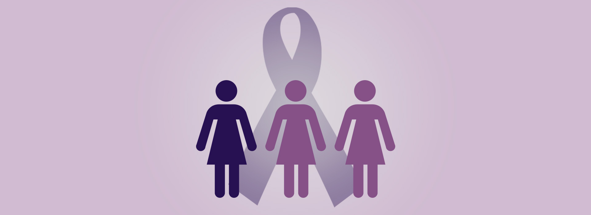

<!DOCTYPE html>
<html lang="en">

	<head>
		<meta charset="utf-8">
		<title>Anneli - Web and interaction designer</title>
		<link href='https://fonts.googleapis.com/css?family=Roboto:300,400,500,900' rel='stylesheet' type='text/css'>
		<link href='http://fonts.googleapis.com/css?family=Rammetto+One' rel='stylesheet' type='text/css'>
		<link rel="stylesheet" href="../css/16dager.css" type="text/css" />
		<link rel="icon" type="image/x-icon" href="favicon.ico" />	
	</head>
	
	<body>
		<?php include '../menu.php'; ?>
		
		

			
		

		
		

			

				<h1>16 dager med aktivisme</h1>
			
				
A campagne for 16 days of activism against gender violence.

			

		

		
		

			<article>
				<h2>About the project</h2>
				
This was a school project where we would develop a campaign concept and how it should be communicated to the target audience. We decided to find a theme that engaged us and that we wanted to engage others with. The choice fell on CARE -- a charitable organization fighting for women's rights. Part of their philosophy is that by helping women in one country, you help everyone. Those who work in CARE are also local.

				
				
We arranged a meeting with CARE Norway to hear if they were interested in cooperating, if the result of the campaign idea was good and if they then wanted to go ahead with the idea. We got input on what angle they wanted and that CARE had a project going called 16 Days of Activism Against Gender Violence. This project is a global campaign originating, not from the West, but from an African grassroots movement. CARE is engaged in this campaign in various countries including in Africa, but it has received little media attention in Norway. This seemed very inspiring and we wanted to continue working on this theme for our campaign to help bring it to media’s attention.
				

			</article>
			
			<article>
				<h2>Challenges</h2>
				
A major task was how to get people in Norway interested in something they've never heard of before. Which approach would give attention? We would rather not think this campaign was to get the same feeling like so much else from Africa get, namely compassion and victimhood. It was important for us to explain that this is a hard fight with strong people; no victims. It’s about someone who takes a stand for their cause and fight for it. It was especially important to keep the focus away from the money collection as this should not be a fundraiser. The vision for the campaign was then to get the target audience engaged and to inspire a sense of prestige and achievement to participate and share the campaign’s message.

			</article>
			
			<article>
				<h2>Solution</h2>
				
The solution was to target a specific audience and not start the campaign in the media but rather see it go viral. The medium we chose was the internet, specifically Facebook and Twitter. We designed a landing page for the campaign to be shared on these social networks. You could also make actions like saying that you are joining the fight against gender-based violence by clicking a button which would  open a window to share on Facebook or Twitter and make your followers aware of the choice you have made.

				
				
You could also order a purple ribbon to wear during the campaign period, for free. Other options were to put purple ribbon on your profile picture on Facebook or enroll in the torchlight procession that would end the campaign. The design would provide a recognizable and strong campaign profile. We wanted to establish the purple loop as a token that clearly associates with this campaign in the same way that the pink loop is associated with the fight against breast cancer. The language of the campaign was written in a way to make people feel that they would join a huge movement that already included many of their friends, families and followers.

			</article>
			
			<a id="project-link" href="/demos/16dager/">Visit page</a>
		

		
		

			
		

		
		

				

					
				

			
			

				
			

			
			

				<ul>
					<li id="color-1"></li>
					<li id="color-2"></li>
					<li id="color-3"></li>
					<li id="color-4"></li>
					<li id="color-5"></li>
				</ul>
			

		

		
		
		
	</body>

</html>