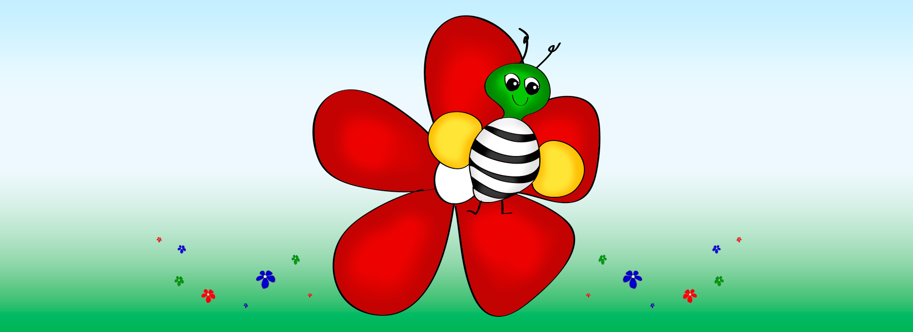
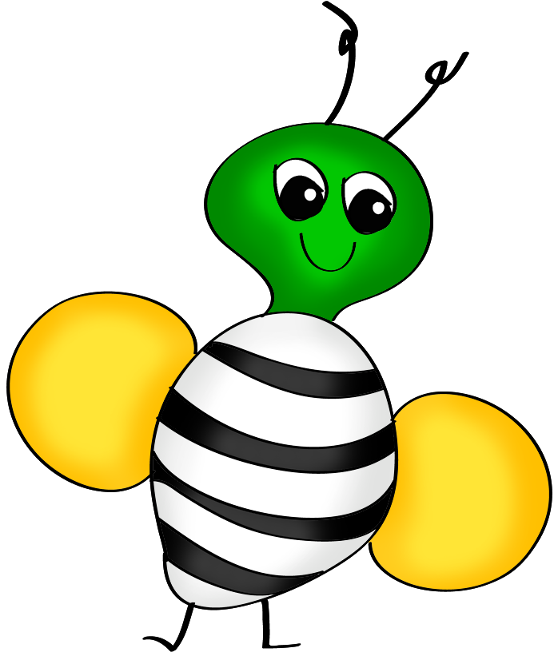
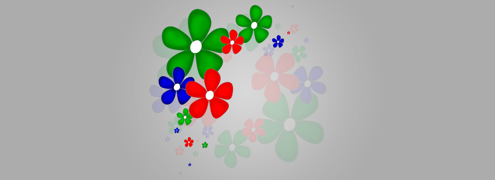

<!DOCTYPE html>
<html lang="en">

	<head>
		<meta charset="utf-8">
		<title>Anneli - Web and interaction designer</title>
		<link href='https://fonts.googleapis.com/css?family=Roboto:300,400,500,900' rel='stylesheet' type='text/css'>
		<link href="http://fonts.googleapis.com/css?family=Sigmar+One" rel="stylesheet" type="text/css">
		<link rel="stylesheet" href="../css/florian.css" type="text/css" />
		<link rel="icon" type="image/x-icon" href="favicon.ico" />	
	</head>
	
	<body>
		<?php include '../menu.php'; ?>
		
		

			
		

		
		

			

				<h1>Florian</h1>
			
				
A game about the bee Florian that flies from flower to flower togather nectar.

			

		

		
		

			<article>
				<h2>About the project</h2>
				
This was a school project where we would create an interactive installation to the theme "connecting the virtual and the physical. " The installation would consist of a physical installation that was connected to a website. I decided to designed a game in which you used a custom gamepad to play the game. I built and programmed this gamepad using Arduino. The game is about a bee that flies from flower to flower by remembering the colour of the flowers. The target audience is children aged 2-5.

			</article>
			
			<article>
				<h2>Challenges</h2>
				
How to make a game that is interesting and challenging, but not so difficult that children might lose interest? Another challenge was to figure out what to do with technology I had never worked with before. It was exciting to see what Arduino could do, but it was hard to not bite off more than I could chew in the time allotted for the project. Figuring out what I could undertake and complete in the given timeframe was essential. The idea for the color game was clear, but coming up with an enthusing game design was also an interesting challenge.

			</article>
			
			<article>
				<h2>Solution</h2>
				
The Florian Colour Game is a colorful and happy memory game with color and sound. You follow Florian The Bee to collect nectar. The game has simple game mechanics so it can easily be played by a child. When each game board is completed, the melody created by collecting nectar is played. The game has many development potentials, such as high scores, score summary between each board and additional colors of the flowers and gamepad buttons.
				

			</article>
			
			<a id="project-link" href="/demos/florian/">Visit page</a>
		

		
		

			
		

		
		

			

				
Sigmar One

			

			
			

				
			

			
			

				<ul>
					<li id="color-1"></li>
					<li id="color-2"></li>
					<li id="color-3"></li>
					<li id="color-4"></li>
					<li id="color-5"></li>
				</ul>
			

		

		

	</body>

</html>