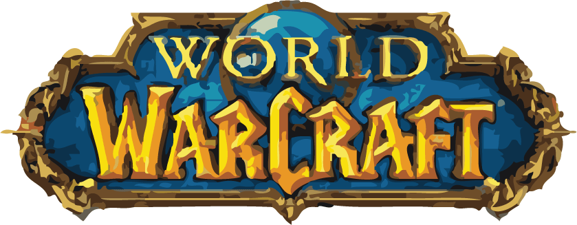
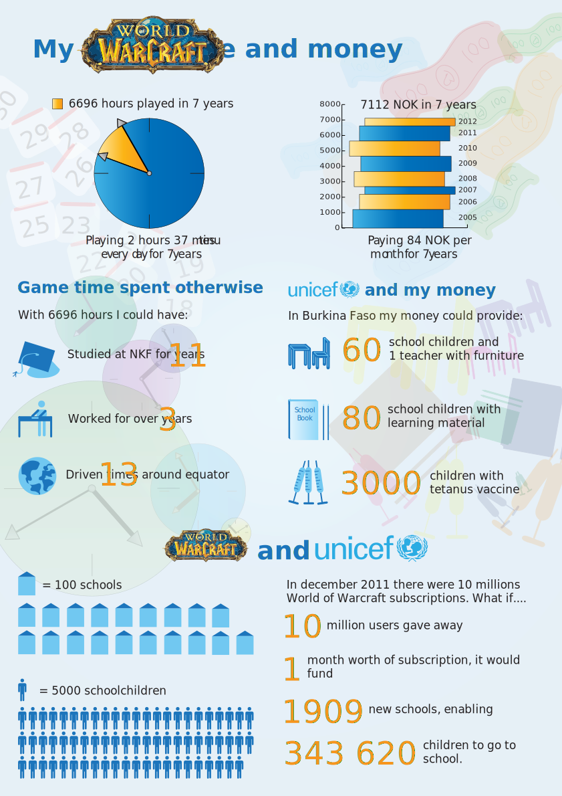
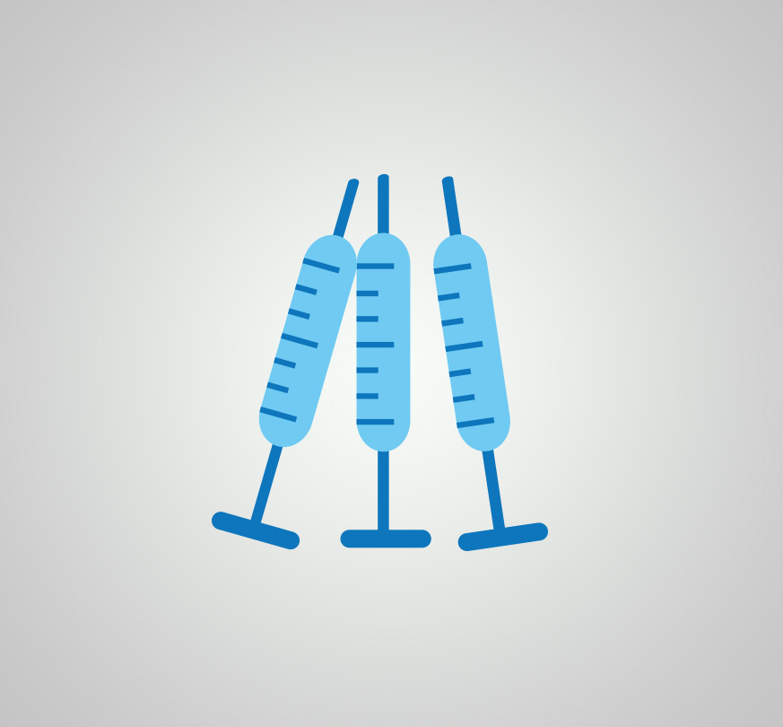
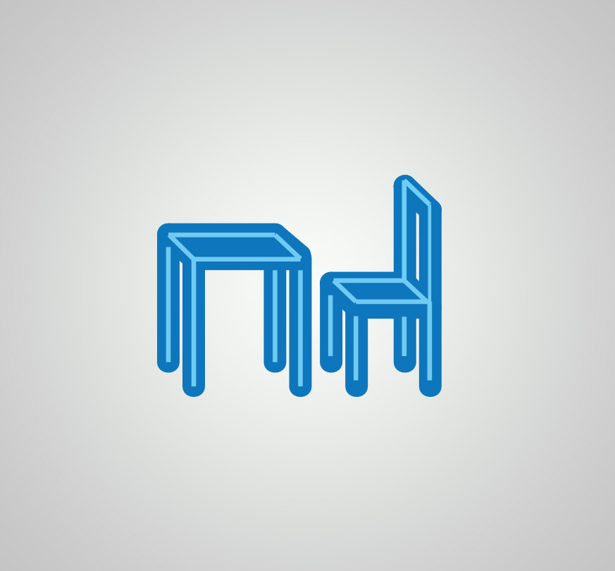

<!DOCTYPE html>
<html lang="en">

	<head>
		<meta charset="utf-8">
		<title>Anneli - Web and interaction designer</title>
		<link href='https://fonts.googleapis.com/css?family=Roboto:300,400,500,900' rel='stylesheet' type='text/css'>
		<link rel="stylesheet" href="../css/infographic-wow.css" type="text/css" />
		<link rel="icon" type="image/x-icon" href="favicon.ico" />	
	</head>
	
	<body>
		<?php include '../menu.php'; ?>

		

			
		

		
		

			

				<h1>World of Warcraft infographic</h1>
			
				
My World of Warcraft gametime and money

			

		

		
		

			<article>
				<h2>About the project</h2>
				
This was a school project where the goal was to present data in a clear, contextual and relevant way. The infographic should show off the data in an interesting way, but at the same time be easy to understand and uncluttered. We were to choose what kind of theme we would present and the choice fell on my World of Warcraft game time and subscription. 
				

			</article>
			
			<article>
				<h2>Challenges</h2>
				
Since money and time spent is not much data, I had to give this an angle that gave it more meaning. To make others interested in something as boring as how much I've played World of Warcraft and what it has cost in time and money, I had to square the data with something that was a huge contrast. A challenge was to convey so much different information without making the message unclear or the design cluttered.
				

			</article>
			
			<article>
				<h2>Solution</h2>
				
To get a unified expression of a variety of information, the design uses a main color, in several different shades. For the World of Warcraft logo to integrate with the rest of the design, the design colors were derived from the logo. This worked great with the blue dominated designed with a flair of the complementary color orange. For the information to be told uniformly and comprehensively, I designed all icons myself. Combined, I think this conveyed the data in an interesting and clear manner.
				

			</article>
			
		

		
		

			
		

		
		

				

					
Lucida Grande

				

			
			

				
			

			
			

				<ul>
					<li id="color-1"></li>
					<li id="color-2"></li>
					<li id="color-3"></li>
					<li id="color-4"></li>
					<li id="color-5"></li>
				</ul>
			

		

			
		
		
		

			
			
			
			
			
			
		

	</body>

</html>