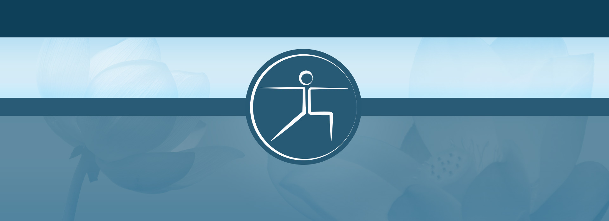
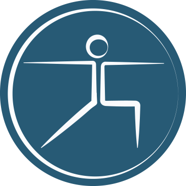
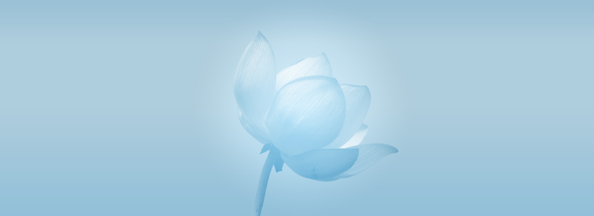

<!DOCTYPE html>
<html lang="en">

	<head>
		<meta charset="utf-8">
		<title>Anneli - Web and interaction designer</title>
		<link href='https://fonts.googleapis.com/css?family=Roboto:300,400,500,900' rel='stylesheet' type='text/css'>
		<link href='http://fonts.googleapis.com/css?family=Fondamento' rel='stylesheet' type='text/css' />
		<link rel="stylesheet" href="../css/iyengaryoganorge.css" type="text/css" />
		<link rel="icon" type="image/x-icon" href="favicon.ico" />	
	</head>
	
	<body>
		<?php include '../menu.php'; ?>

		

			
		

		
		

			

				<h1>Iyengar yoga Norge</h1>
			
				
Web design and site for Iyengar Yoga Norge.

			

		

		
		

			<article>
				<h2>About the project</h2>
				
This was a school project for Iyengar Yoga Norway. They wanted a website that informed about Iyengar Yoga in Norway, what Iyengar yoga is, where you could learn it, and when you could sign up for courses.

				
				
The project started with a customer brief, where we talked to them about their needs and desires. We then continued to work on strategy, content production, information architecture, and design research. This resulted in a design document, that was presented to the customer on the progression meeting halfway in the project. We had a week from the customer brief to the completion of the project and presentation of our work to the customer. The customer would then consider all concepts freely and could choose to use one, several or none of the concepts in the final solution.
			</article>
			
			<article>
				<h2>Challenges</h2>
				
In such a tight time frame it was challenging to keep track of all business processes we were mandated to go through and then additionally be able to deliver on the deadline. It was important to produce a high quality product in a short amount of time. It was important to be able to convey the feeling of balance, calm and in control design solution so that the experience of using the site reflected the feeling of Iyengar yoga.
				

			</article>
			
			<article>
				<h2>Solution</h2>
				
The solution was a design in monochrome colors with nuances of aqua blue, which creates a calm expression. The menu is easily accessible at the top of the submenu for further exploration of the page. The site is also designed in a 960 grid to achieve balance and control of information. The solution appears to be simple and hassle free to navigate aroun
				

			</article>
			
			<a id="project-link" href="/demos/iyengaryoganorge/">Visit page</a>
		

		
		

			
		

		
		

				

					
Fondamento

				

			
			

				
			

			
			

				<ul>
					<li id="color-1"></li>
					<li id="color-2"></li>
					<li id="color-3"></li>
					<li id="color-4"></li>
					<li id="color-5"></li>
				</ul>
			

		

		

	</body>

</html>