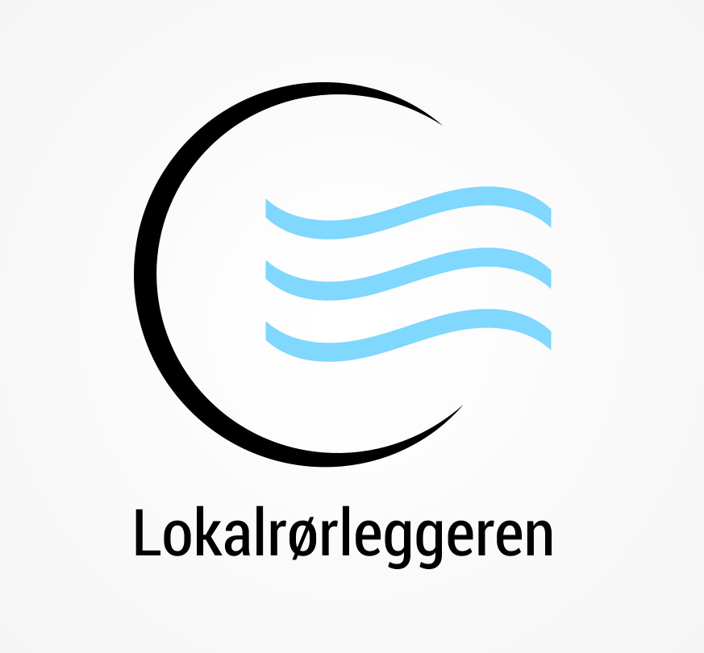
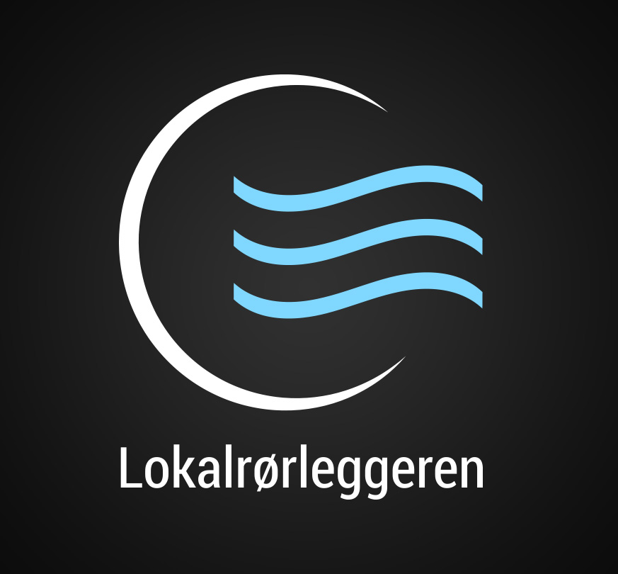
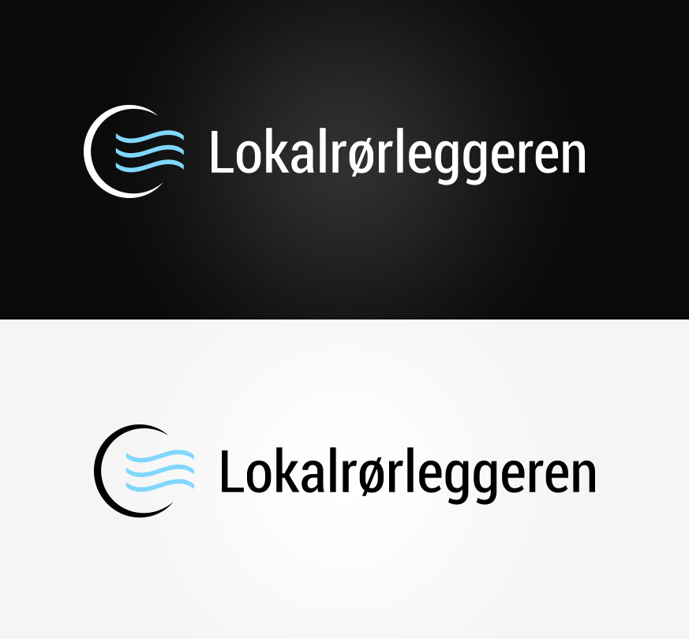
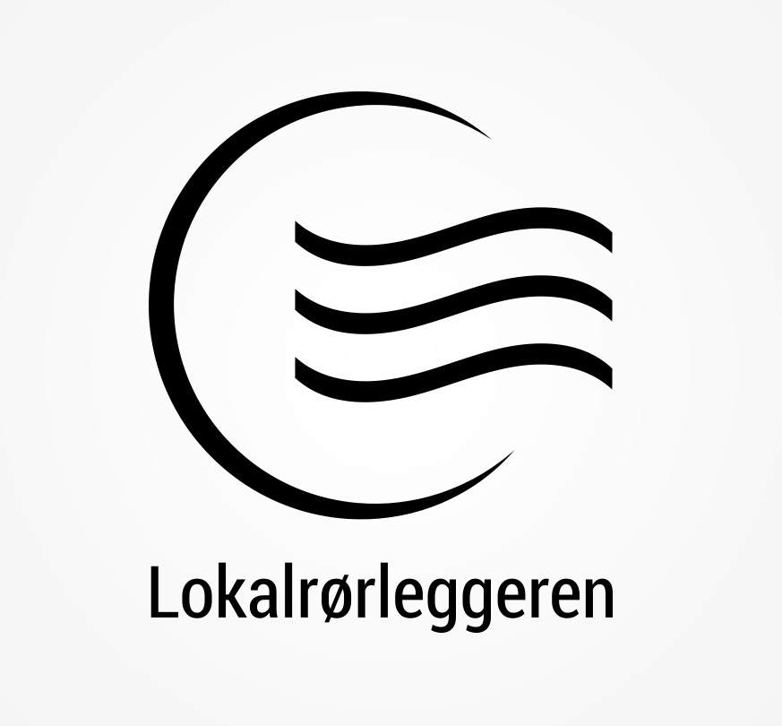
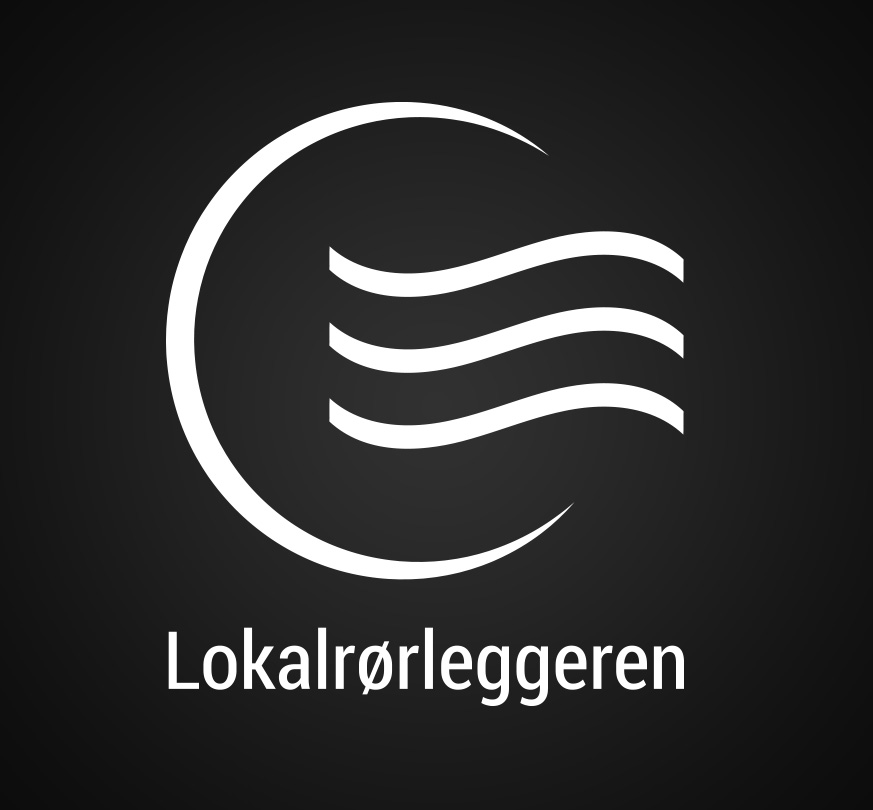
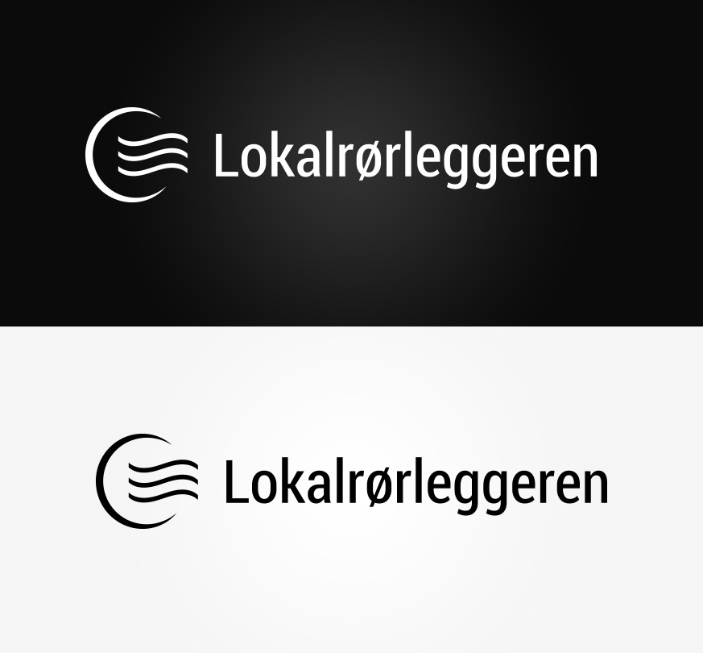

<!DOCTYPE html>
<html lang="en">

	<head>
		<meta charset="utf-8">
		<title>Anneli - Web and interaction designer</title>
		<link href='https://fonts.googleapis.com/css?family=Roboto:300,400,500,900' rel='stylesheet' type='text/css'>
		<link rel="stylesheet" href="../css/lokalrorleggeren.css" type="text/css" />
		<link rel="icon" type="image/x-icon" href="favicon.ico" />	
	</head>
	
	<body>
		<?php include '../menu.php'; ?>

		

			
		

		
		

			

				<h1>Lokalrørleggeren AS</h1>
			
				
The logo and business card for Lokalrørleggeren AS

			

		

		
		

			<article>
				<h2>About the project</h2>
				
The client needed to get a logo and business card designed for for his plumbing company.

			</article>
			
			<article>
				<h2>Challenges</h2>
				
The client did not wish to use the drop of water or wrench that is often used in the design for plumbing. I totally agreed with the client and had to find some other element that could be assosiated with plumbing. It also was important to design a logo that was versatile that could be used on a car, website or business card.

			</article>
			
			<article>
				<h2>Solution</h2>
				
The logo illustration can be used in a horizontal or vertical design. It also works in color, full black or white depending on how the client will use it. The end result is a modern and recognisable logo inspired by water, pipe and air and the usability is very flexible.

			</article>
			
		

		
		

			
		

		
		

				

					
				

			
			

				
			

			
			

				<ul>
					<li id="color-1"></li>
					<li id="color-2"></li>
					<li id="color-3"></li>
					<li id="color-4"></li>
					<li id="color-5"></li>
				</ul>
			

		

			
		

			
			
			
			
			
			
		

	</body>

</html>