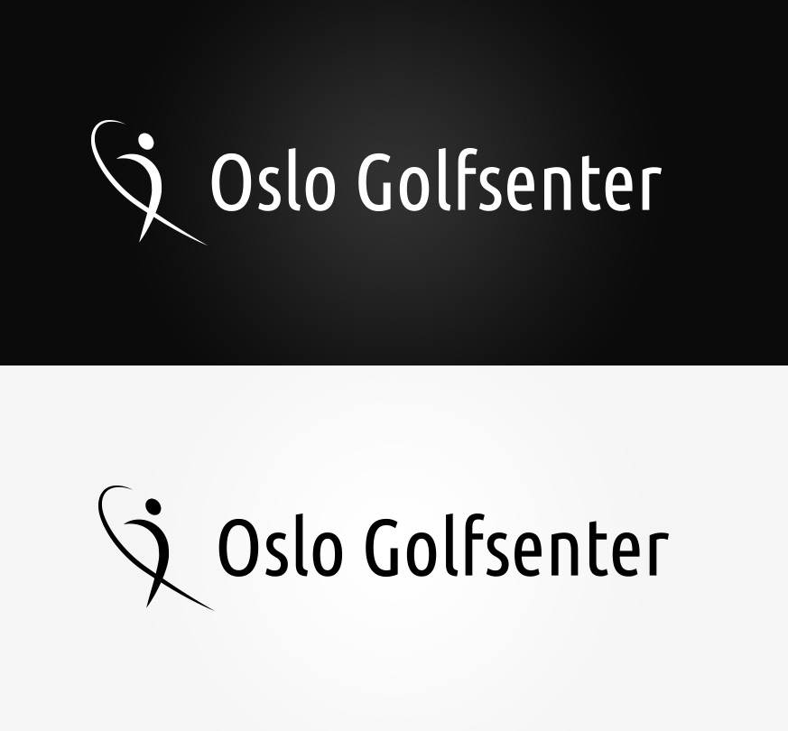

<!DOCTYPE html>
<html lang="en">

	<head>
		<meta charset="utf-8">
		<title>Anneli - Web and interaction designer</title>
		<link href='https://fonts.googleapis.com/css?family=Roboto:300,400,500,900' rel='stylesheet' type='text/css'>
		<link rel="stylesheet" href="../css/oslogolfsenter.css" type="text/css" />
		<link rel="icon" type="image/x-icon" href="favicon.ico" />	
	</head>
	
	<body>
		<?php include '../menu.php'; ?>

		

			
		

		
		

			

				<h1>Oslo Golfsenter</h1>
			
				
The logo for Oslo Golfsenter.

			

		

		
		

			<article>
				<h2>About the project</h2>
				
The client needed to get a logo designed for the golfsenter he is starting.

			</article>
			
			<article>
				<h2>Challenges</h2>
				
The challange here was to not get caught up in cliché of using the over used golfball, tee or the color green when designing for golf. It also was important to design a logo that could be used on merchendises and easy recogniseable.

			</article>
			
			<article>
				<h2>Solution</h2>
				
The logo illustration can be used in a horizontal or vertical design. It also works in color, full black or white depending on how the client will use it. The end result is a modern, sleek and minimalistic logo inspired by the golf swing and the usability is very flexible.

			</article>
			
		

		
		

			
		

		
		

				

					
				

			
			

				
			

			
			

				<ul>
					<li id="color-1"></li>
					<li id="color-2"></li>
					<li id="color-3"></li>
					<li id="color-4"></li>
					<li id="color-5"></li>
				</ul>
			

		

			
		

			
			
			
			
			
			
		

	</body>

</html>