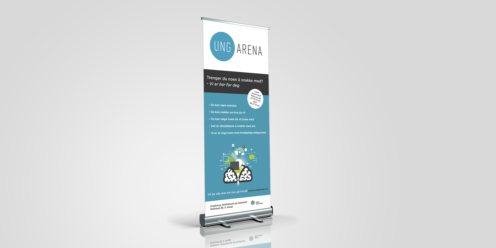
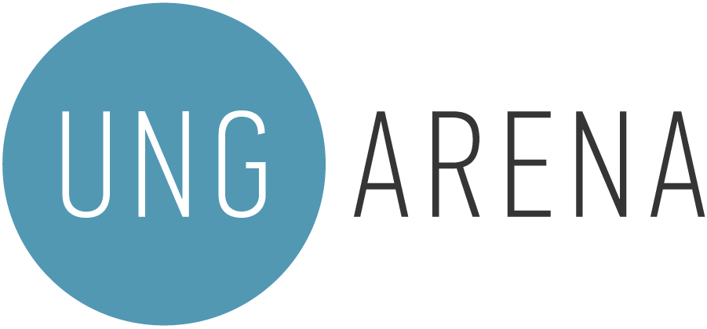
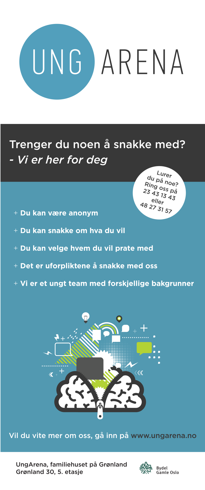

<!DOCTYPE html>
<html lang="en">

	<head>
		<meta charset="utf-8">
		<title>Anneli - Web and interaction designer</title>
		<link href='https://fonts.googleapis.com/css?family=Roboto:300,400,500,900' rel='stylesheet' type='text/css'>
		<link rel="stylesheet" href="../css/ungarena.css" type="text/css" />
		<link rel="icon" type="image/x-icon" href="favicon.ico" />	
	</head>
	
	<body>
		<?php include '../menu.php'; ?>

		

			
		

		
		

			

				<h1>UngArena Oslo</h1>
			
				
Rollup for UngArena Oslo.

			

		

		
		

			<article>
				<h2>About the project</h2>
				
The client needed to get a rollup designed.

			</article>
			
			<article>
				<h2>Challenges</h2>
				
This was a newly started company and they did not have any design guide for UngArena. They only knew they wanted to be interesting and not boring for their target audience.

			</article>
			
			<article>
				<h2>Solution</h2>
				
Since their target audience are people from 12 - 25 years old I had to design something that was not excluding anyone. The solution was using an illustration and colors that was not gender or age specefic. I also used their logo colors in the rollup to make it more recognisable.

			</article>
			
		

		
		

			
		

		
		

				

					
				

			
			

				
			

			
			

				<ul>
					<li id="color-1"></li>
					<li id="color-2"></li>
					<li id="color-3"></li>
					<li id="color-4"></li>
					<li id="color-5"></li>
				</ul>
			

		

			
			
		
		
	</body>

</html>